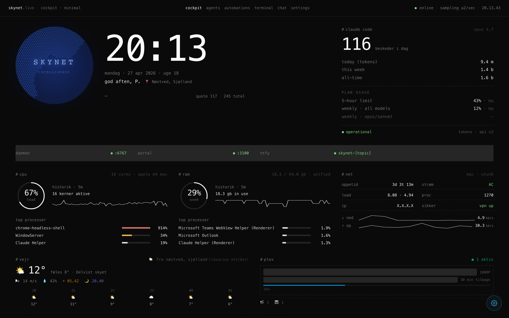
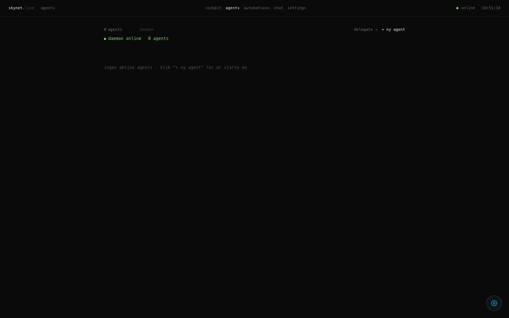
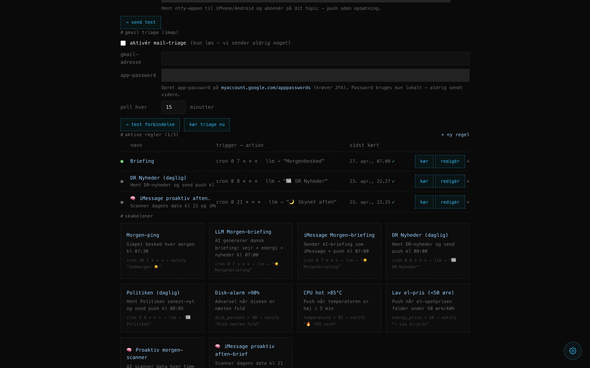
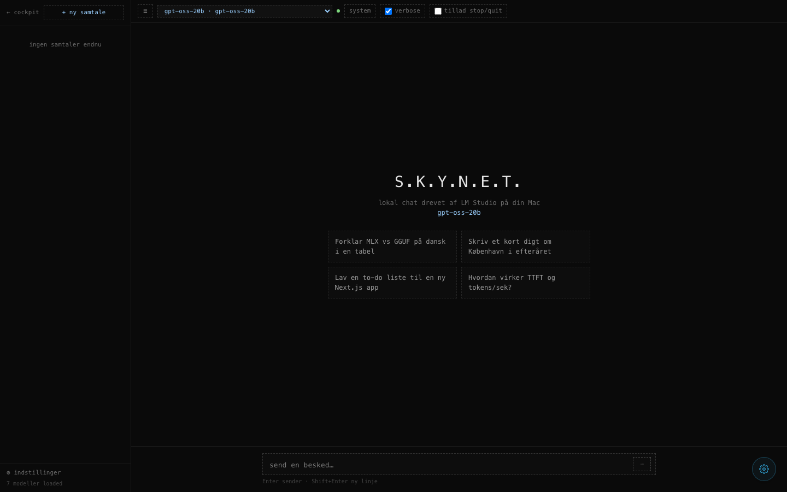

# S.K.Y.N.E.T.

**System for Knowledge, Yielding Neural Engagement & Tasks**

Personlig intelligens-platform til macOS — live cockpit-dashboard, lokal AI-chat, agent-orkestrering og smarte automationer. Alt kører lokalt, ingen cloud-afhængighed.

```bash
curl -fsSL https://raw.githubusercontent.com/Parthee-Vijaya/skynet/main/scripts/install.sh | bash
```

Installerer Homebrew, Node 20+, kloner repo, bygger alt og sætter LaunchAgents op så Skynet starter automatisk ved login.

---

## Screenshots

### Cockpit · Dashboard



Live cockpit i starquake-minimal-stil. Venstre: animeret Three.js-globus med SKYNET-overlay, live ur og dato, roterende citater. Midt: system-widgets — CPU-ring med historik-sparkline, RAM, netværk. Højre: Claude Code-statistik. Nedenunder: disk-volumener, services & porte og GitHub Trending repos (live, opdateres hvert 5 min).

---

### Agents



Oversigt over alle kørende og afsluttede AI-agenter. Daemon-status i realtid (WebSocket :6767). Opret en ny agent med et prompt og vælg model fra LM Studio — agenten kører i baggrunden og vises med status (`running`, `idle`, `stopped`, `error`). Klik `delegate →` for direkte prompt-routing.

---

### Automations



Regel-motor med tre trigger-typer og tre action-typer:

| Trigger | Beskrivelse |
|---------|-------------|
| **Cron** | Standard cron-expression (`0 7 * * *` = 07:00 hver dag) |
| **Tærskel** | Metrik-baseret (`disk_percent > 90`, `temperature > 85`…) |
| **Manuel** | Klik `kør` fra UI |

| Action | Beskrivelse |
|--------|-------------|
| **Simpel besked** | Fast push-notifikation via ntfy eller macOS Notification Center |
| **LLM-genereret besked** | LM Studio-model genererer tekst med tool-calling (vejr, el-pris, nyheder, web-søgning) — resultatet pushes som notifikation og/eller sendes som iMessage |
| **Kør tool** | Direkte kald til et system-tool: `send_imessage`, `control_app`, `fetch_news`, `web_search` m.fl. |

Notifikations-backends: ntfy (iPhone/Android push), macOS Notification Center.

---

### Chat



Lokal AI-chat drevet af LM Studio på din Mac. Model-picker øverst — skifter live mellem alle indlæste modeller (GGUF, MLX). Sidebar med samtale-historik. Streaming-svar med Markdown-rendering. Understøtter tool-invocations (system-status, kalender, vejr, web-søgning) vist inline i chatten.

---

## Features

- **Cockpit-dashboard** — starquake minimal-stil, `#0a0a0a`, JetBrains Mono, dashed borders
- **Animated globe** — Three.js + three-globe, blue halo, auto-rotation, SKYNET-overlay
- **GitHub Trending** — top repos fra sidste 7 dage, language-dots, HOT/NEW badges, live ★-count
- **System-telemetri** — CPU, RAM, netværk, disk, temperatur, top-processer
- **Services & porte** — scanner via `lsof`, viser status, kategori og PID
- **LM Studio chat** — lokal model, streaming, tool-calling, Markdown
- **Agent-daemon** — AI-agenter der kører autonomt (WebSocket-protokol)
- **Automations** — cron + tærskel triggers, kædede actions, LLM-actions med tools, push + iMessage delivery
- **Proaktive agents** — LLM kan returnere `NONE` for at skippe notifikation · kun pinger når noget er handlingsværdigt
- **iMessage delivery** — send LLM-genererede briefings direkte til din iPhone
- **Nyhedsfeeds** — `fetch_news` tool parser RSS-feeds (DR, TV2, Børsen…)
- **Web tools** — `web_fetch` + `web_search` (DuckDuckGo) til LLM-tool-loop
- **macOS-integrationer** — kalender, påmindelser, apps (`open -a`), LaunchAgents
- **ntfy push** — pushes til iPhone/Android uden Apple Developer-konto
- **PWA / iOS home-screen** — installér som app via Safari "Føj til hjemmeskærm" · manifest, service-worker, standalone-mode
- **Siri-endpoint** — `/api/siri?q=...` returnerer kort plain-text · fede Apple Shortcut → "Hey Siri, spørg Skynet ..."
- **Plex nu-afspilles** — live streams, progress, bibliotek-stats i cockpit

---

## Hurtig start

```bash
# Fresh Mac — installér alt
curl -fsSL https://raw.githubusercontent.com/Parthee-Vijaya/skynet/main/scripts/install.sh | bash
```

Scriptet er idempotent — kan køres igen for at opdatere.

**Valgfrie env-variabler:**

```bash
SKYNET_HOME=~/mit-skynet \
SKYNET_REPO=https://github.com/Parthee-Vijaya/skynet.git \
  bash <(curl -fsSL …/install.sh)
```

---

## Development

```bash
npm install              # Installer alle workspace-dependencies
npm run dev              # Portal + daemon (concurrent)
npm run dev:portal       # Kun portal  → http://localhost:3100
npm run dev:daemon       # Kun daemon  → ws://localhost:6767
npm run build:daemon     # Byg highlight + relay + daemon + cli
npm run typecheck        # Typecheck alle pakker
```

---

## Arkitektur

```
skynet/
├── packages/
│   ├── portal/         Next.js 16 dashboard (port 3100)
│   │   ├── src/app/    App Router: /, /minimal, /agents, /automations, /chat, /settings
│   │   └── src/lib/    Collectors, agent-tools, dispatcher, automations-engine
│   ├── daemon/         Agent-daemon (port 6767, WebSocket)
│   ├── relay/          WebSocket relay bridge
│   ├── highlight/      Syntax highlighting engine
│   ├── cli/            CLI-tool (`skynet`)
│   └── hud/            Native macOS menu-bar (Swift)
├── scripts/
│   ├── install.sh      One-command installer
│   └── dev.sh          Development-starter
└── docs/
    └── screenshots/    README-screenshots
```

---

## Services

| Service | Port | Beskrivelse |
|---------|------|-------------|
| Portal  | 3100 | Web dashboard — widgets, chat, agents, automations |
| Daemon  | 6767 | Agent-livscyklus via WebSocket |
| HUD     | —    | Native macOS menu-bar companion |

---

## LaunchAgents (autostart)

Installeret af `install.sh` til `~/Library/LaunchAgents/`:

```
com.skynet.portal.plist   → npm start @ packages/portal (port 3100)
com.skynet.daemon.plist   → npm start @ root (daemon, port 6767)
```

```bash
# Start / stop manuelt
launchctl kickstart -k gui/$(id -u)/com.skynet.portal
launchctl bootout   gui/$(id -u)/com.skynet.portal

# Logs
tail -f ~/Library/Logs/skynet-daemon.err.log
```

---

## Opdatering

```bash
cd ~/skynet
git pull
npm install
npm run build:daemon
npm run build --workspace=@skynet/portal
launchctl kickstart -k gui/$(id -u)/com.skynet.portal
launchctl kickstart -k gui/$(id -u)/com.skynet.daemon
```

---

## Tilføj widgets

1. Opret `packages/portal/src/components/minimal/widgets/MinWidget.tsx`
2. Registrér i `widgets/index.ts`:
   ```ts
   registerWidget({ id: "min", group: "system", colSpan: 4, Component: MinWidget });
   ```
3. Rebuild og genstart portal.

---

## Tilføj automation-tools

1. Tilføj schema i `src/lib/agent/tools.ts`
2. Tilføj handler i `src/lib/agent/dispatcher.ts`
3. Tool er automatisk tilgængeligt i LLM-tool-loop og `ToolAction`-automationer.

---

## iOS / Siri

**PWA på iPhone hjemmeskærm:**

1. Åbn `http://<din-mac>:3100/minimal` i Safari på iPhone (samme WiFi eller via Tailscale)
2. Del-knap → **"Føj til hjemmeskærm"**
3. Åbner i standalone-mode · live vejr/energi/status opdateres hvert 15 min selv når skærmen er væk

**Siri via Apple Shortcuts:**

1. Opret en ny shortcut → **"Hent URL"** action → `http://<din-mac>:3100/api/siri?q=[Diktér tekst]`
2. Sæt headers til `Accept: text/plain` · brug `POST` hvis du vil lade spørgsmålet være længere
3. Tilføj **"Tal tekst"** action efter med output fra forrige step
4. Navngiv shortcut "Spørg Skynet" → **"Hey Siri, spørg Skynet"** virker nu

LLM'en har adgang til alle Skynet tools (vejr, energi, kalender, nyheder, web-søgning) og svaret er begrænset til 2-3 korte danske sætninger.

---

## Krav

- macOS 13+ (Ventura eller nyere)
- Node.js 20+
- LM Studio (valgfrit — til chat og LLM-automationer)
- ntfy-app (valgfrit — til iPhone/Android push)

---

## License

Private.
